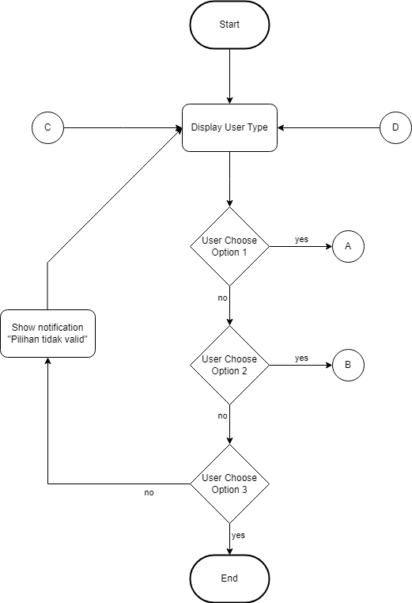
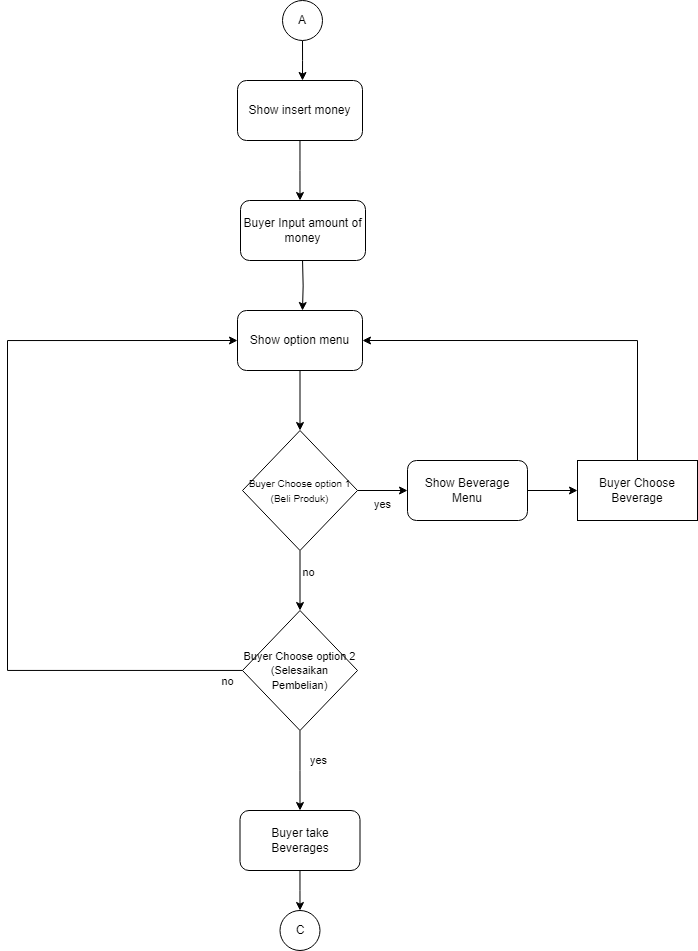
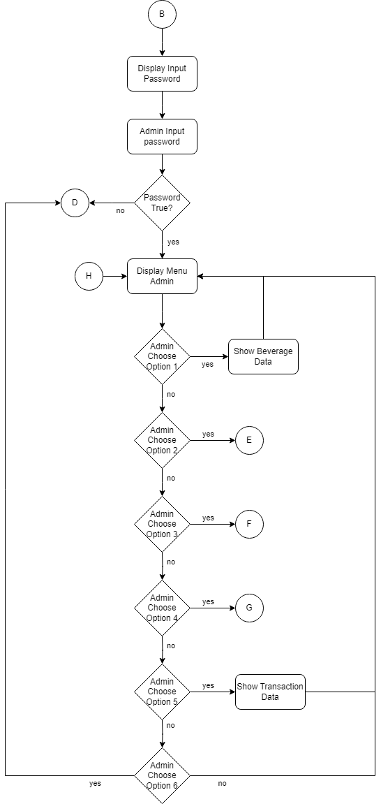
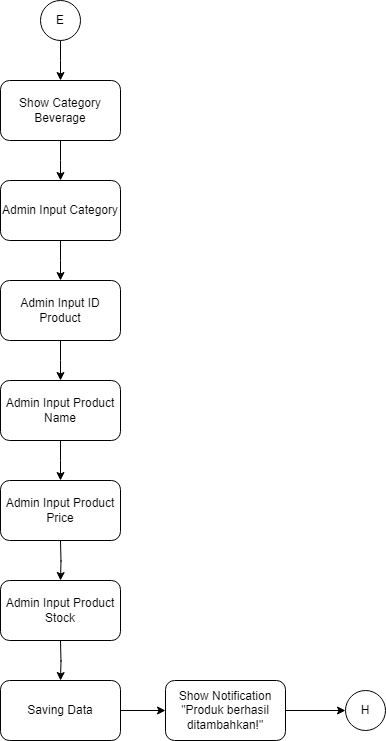
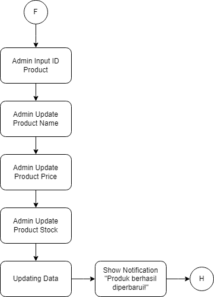
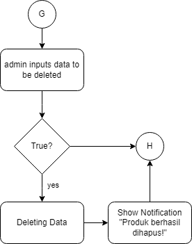

# Vending Machine Console Application

## Description
Aplikasi ini adalah simulasi mesin penjual otomatis (vending machine) berbasis Python yang berjalan di console. Pengguna dapat memilih produk, memasukkan uang, dan menerima kembalian sesuai dengan harga produk yang dipilih.

## Flowchart
Berikut adalah flowchart yang menggambarkan alur program:

### Login

### User Menu

### Admin Menu

### Create Menu

### Update Menu

### Delete Menu

